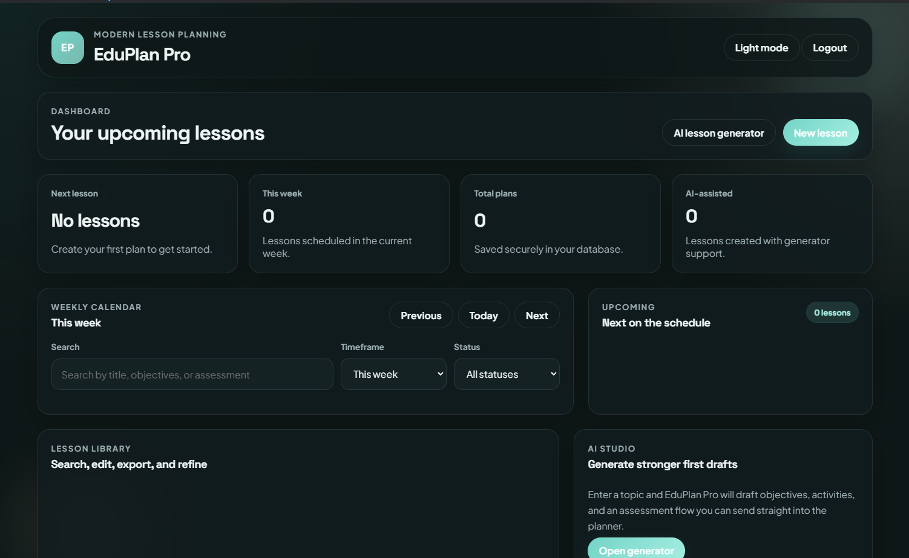
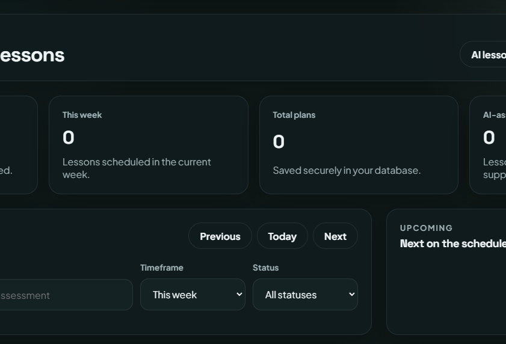

# EduPlan Pro

EduPlan Pro is a lesson-planning desktop application concept built for students and teachers who need a cleaner way to draft lessons, organize weekly schedules, and prepare structured teaching materials.

This repository is now a showcase repository. The implementation has been removed to keep the product presentation public without exposing the source code.

## Overview

EduPlan Pro was designed as a productivity-focused desktop experience that combines planning, lesson organization, and AI-assisted drafting into one workflow. The goal was to make lesson creation feel more structured, less repetitive, and easier to manage across a weekly schedule.

## Quick Links

- GitHub Repository: [EuriKIMI/lesson-planner](https://github.com/EuriKIMI/lesson-planner)
- Request Live Demo: [LinkedIn](https://www.linkedin.com/in/kimieuriestacio/)

## Key Features

- Clean desktop dashboard for planning and lesson management
- Weekly calendar view for organizing lesson flow
- Structured lesson creation and editing workflow
- Cloud-backed storage concept for persistent lesson data
- AI-assisted drafting flow for generating lesson starting points
- PDF export workflow for printable planning output
- Responsive UI and dark-mode-friendly product styling

## Technology Stack

- Electron
- HTML
- CSS
- JavaScript
- Supabase
- AI-assisted workflow design

## Screenshots

### Dashboard Overview

### Planning Workflow Detail

## Design Process

### Product Direction

The product was planned around a practical question: how can lesson planning feel more like a focused workflow tool and less like a collection of disconnected forms?

### UX Goals

- Reduce friction when creating and revisiting lesson plans
- Keep the dashboard readable for both short sessions and deeper planning work
- Support repeatable planning patterns with structured content blocks
- Make the interface feel modern, calm, and task-oriented

### UI Decisions

- Card-based dashboard layout for stronger visual grouping
- Clear content hierarchy to separate planning, editing, and review states
- Soft contrast and spacious layout to improve long-session readability
- Product-style interface choices instead of a document-heavy academic layout

## Project Status

**Status:** Archived as a public showcase

- The source code and implementation files have been removed from this repository.
- This repository is now maintained as a portfolio presentation only.
- The project is not currently maintained as an open-source codebase.
- Private implementation details are intentionally not included.

## Why The Source Code Was Removed

This repository now exists to present the product direction, UI, and feature thinking without exposing the full implementation. It remains available as a case-study style showcase for portfolio and professional review.
